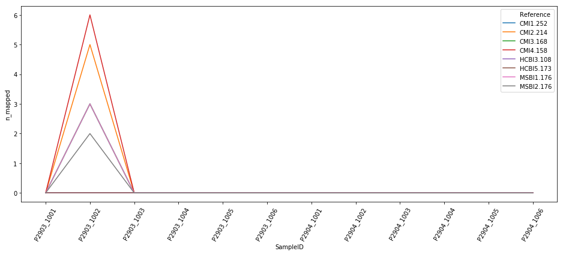
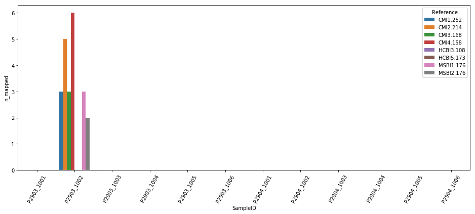
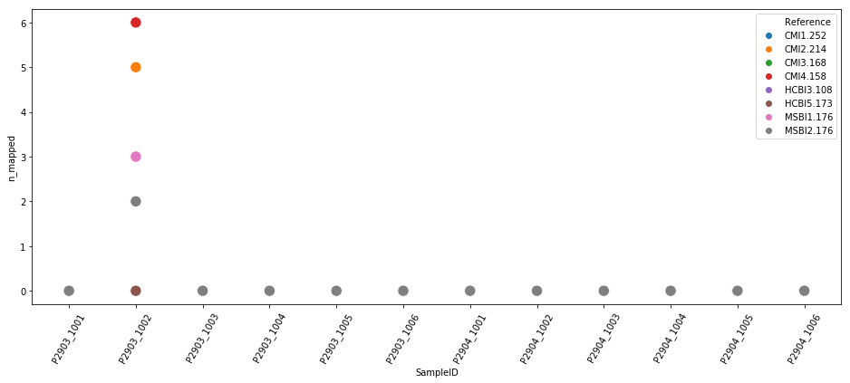
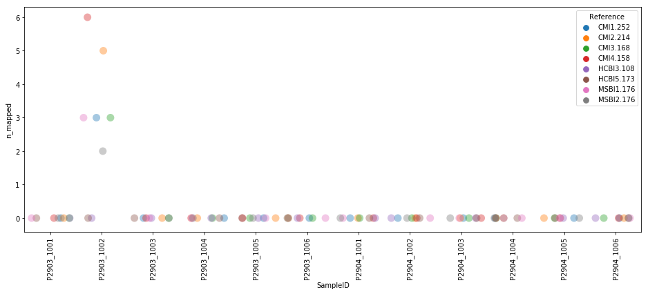
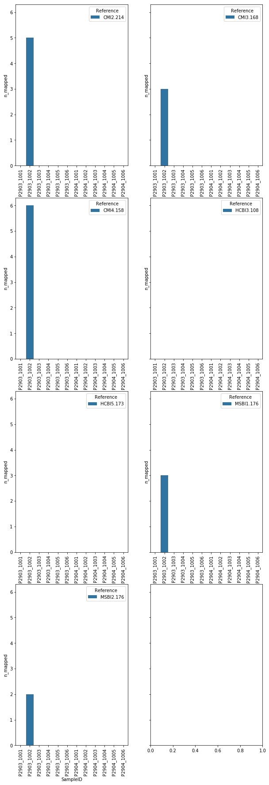

```python
import os
import glob
import re
import pandas as pd
import seaborn as sns
import matplotlib.pyplot as plt
import random

```


```python
df=pd.read_csv('/home/amanj/Documents/jupyterNotebook/LCH_episome_mapped_reads.tsv', sep='\t').sort_values(by=['SampleID'], ascending=False)
df1=pd.read_csv('/home/amanj/Documents/jupyterNotebook/LCH_episome_mapped_reads.tsv', sep='\t').drop(['pct_mapped'], axis=1).groupby(by=['SampleID','Reference']).sum().reset_index()

col_name =df1.columns[1]
df1=df1.rename(columns = {col_name:'Reference'})
```


```python
print(df1)
```


```python
print(df)
#df1.select("Reference").show() 
```


```python
#print(df1['n_mapped'])
```


```python
df2 = df1[df1.Reference == "CMI2.214"]
df3 = df1[df1.Reference == "CMI3.168"]
df4 = df1[df1.Reference == "CMI4.158"]
df5 = df1[df1.Reference == "HCBI3.108"]
df6 = df1[df1.Reference == "HCBI5.173"]
df7 = df1[df1.Reference == "MSBI1.176"]
df8 = df1[df1.Reference == "MSBI2.176"]


```


```python
#df1.Reference == "CMI1.252"
print(df2)
print(df3) 


```


```python
#fig, axes = plt.subplots(nrows=4, ncols=2)

df2.plot.bar("SampleID","n_mapped")
df3.plot.bar("SampleID","n_mapped")
df4.plot.bar("SampleID","n_mapped")
df5.plot.bar("SampleID","n_mapped")
df6.plot.bar("SampleID","n_mapped")
df7.plot.bar("SampleID","n_mapped")
df8.plot.bar("SampleID","n_mapped")
#df2.plot.bar
#plt.show()
```


```python
#?df2.plot
#fig, ax = plt.subplots()
#df1.groupby('Reference').plot.line(x='SampleID', y='n_mapped', ax=ax, legend=True)
plt.figure(figsize=(16, 6))
plotFig = sns.lineplot('SampleID', 'n_mapped', data=df1, hue ='Reference')
for item in plotFig.get_xticklabels():
    item.set_rotation(60)


```





```python
plt.figure(figsize=(16, 6))
plotFig = sns.barplot('SampleID', 'n_mapped', data=df1, hue ='Reference')
for item in plotFig.get_xticklabels():
    item.set_rotation(60)
```





```python
?df1.plot.line
```


```python
plt.figure(figsize=(16, 6))
plotFig = sns.scatterplot('SampleID', 'n_mapped', data=df1, hue ='Reference',s=150, alpha=1)
#sns.regplot(x=df1['SampleID'], y=df1["n_mapped"], fit_reg=False, scatter_kws={"color":"darkred","alpha":0.3,"s":200} )

for item in plotFig.get_xticklabels():
    item.set_rotation(60)
```





```python
plt.figure(figsize=(16, 6))
random.seed( 10 )
plotFig = sns.stripplot('SampleID', 'n_mapped', data=df1, hue ='Reference',s=11, alpha=0.4,jitter=0.4)

for item in plotFig.get_xticklabels():
    item.set_rotation(90)
```





```python
#fig = plt.figure(figsize=(16, 6))
f, axes = plt.subplots(4, 2, sharey=True, figsize=(10, 6))
f.subplots_adjust(top=4)

g= sns.barplot('SampleID', 'n_mapped', data=df2, hue ='Reference', ax=axes[0][0])
for item in g.get_xticklabels():
    item.set_rotation(90)
g1= sns.barplot('SampleID', 'n_mapped', data=df3, hue ='Reference', ax=axes[0][1])
for item in g1.get_xticklabels():
    item.set_rotation(90)
g2= sns.barplot('SampleID', 'n_mapped', data=df4, hue ='Reference', ax=axes[1][0])
for item in g2.get_xticklabels():
    item.set_rotation(90)
g3= sns.barplot('SampleID', 'n_mapped', data=df5, hue ='Reference', ax=axes[1][1])
for item in g3.get_xticklabels():
    item.set_rotation(90)
g4= sns.barplot('SampleID', 'n_mapped', data=df6, hue ='Reference', ax=axes[2][0])
for item in g4.get_xticklabels():
    item.set_rotation(90)
g5= sns.barplot('SampleID', 'n_mapped', data=df7, hue ='Reference', ax=axes[2][1])
for item in g5.get_xticklabels():
    item.set_rotation(90)
g6= sns.barplot('SampleID', 'n_mapped', data=df8, hue ='Reference', ax=axes[3][0])
for item in g6.get_xticklabels():
    item.set_rotation(90)
```





```python

```


```python

```
